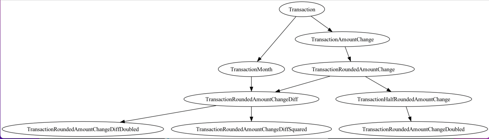

Feature Forger
---
---

### What is it / what does it do / why use it?

- Developed by me (& ChatGPT) (40/60 split)
- Framework for feature engineering - standardize the process
- Faster time to experiemnt
- Share knowledge around datasets for better models
- Encourages domain driven design for easy to read / productionise code
- Encourages single responsibility 
- Optimises order of feature computation without user input*

### What it doesn't do?

- Production quality speed (yet)
- Dask or spark support (yet)
- Pretty much anything else you could possibly think of

<br/>

## Overview

---

The `feature-forger` package is designed to be used as a framework for documenting, in code, new features that are engineered from commonly used datasets. Over time, this framework can save time re-engineering of features, help data scientists share knowledge and speed up experimentation. 

The package is built around the creation of 3 key entities:
1. `EntityModel`
2. `Dataset`
3. `Feature`

Each feature is defined by a function that operates on a dataframe row, where a single dataframe row is at the level of the entity model. For example, an entity model may be a bank transaction, an account, a Person, etc. i.e. a dataframe where each row represents a transaction.

A dataset is a model representing a commonly used dataset, with column names and data types. Each dataset should have at least one supported entity model. For example, a bank statement for multiple accounts may support 2 entity models - transaction level and account level. And the dataset created must implement at method that maps the data to that entity level, such as through a group by operation.
> Note: the implementation of features on-top of a grouped dataframe is still in development.

<br/>

## Getting Started

---

1. Create datasets that inherit from `Dataset`. The datasets created should be added to the `feature_forger.datasets` package where they can then be used by other developers.
   
   Datasets must support one or more entity models. Entity Models are based of the pydantic `BaseModel`, and supports the use of the pydantic `Field`. The dataset created should implement the `map_rows_to_entity` method as described previously.
   ```python
   from datetime import datetime
   
   from feature_forger import EntityModel, Dataset
   from pydantic import Field
   
   
   class Transaction(EntityModel):
      account_no: str = Field(alias="Account No")
      date: datetime = Field(alias="DATE")
      trn_details: str = Field(alias="TRANSACTION DETAILS")
      chq_no: float = Field(alias="CHQ.NO.")
      value_date: datetime = Field(alias="VALUE DATE")
      withdrawal_amount: float = Field(alias="WITHDRAWAL AMT")
      deposit_amount: float = Field(alias="DEPOSIT AMT")
      balance_amount: float = Field(alias="BALANCE AMT")
   
   
   class BankStatement(Dataset):
      supported_entity_models = (Transaction,)
   
      def map_rows_to_entity() -> pd.DataFrame:
         ...
   
   ```
   
1. With a `DataSet` prepared, features can be created. Each feature must implement a `row_compute_fn` which is a function to operate on a single pandas dataframe row. Optionally a `table_compute_fn` can be implemented to run against a dataframe, this is best for using vectorised methods. `table_compute_fn` implementations are presumed to be faster than looping over the dataset to apply the `row_compute_fn` so will be preferred where possible.
   Dependencies can be listed to ensure that the order of feature computation is correct.
   The `EntityModel` must be set in order to instruct the feature forger on what data the feature is valid.
   ```python
   from typing import Type, Tuple, Optional

   import pandas as pd
   from pydantic import Field
   from pydantic.dataclasses import dataclass
   
   from feature_forger.domain.entities.entity_model import EntityModel
   from feature_forger.domain.entities.feature import Feature
   from tests.common.entity_models.transaction import \
       Transaction

   
   @dataclass(frozen=True)
   class TransactionMonth(Feature):
       col_name: str = "value_month"
       description: str = "month of the value date for the transaction"
       entity_model: Type[EntityModel] = Transaction
       dependencies: Optional[Tuple[Feature]] = Field(default_factory=tuple)
   
       def row_compute_fn(self, data: pd.Series):
           data[self.col_name] = data[Transaction['value_date']].month
           return data
   
       def table_compute_fn(self, data: pd.DataFrame):
           data[self.col_name] = data[Transaction['value_date']].dt.month
           return data
   ```
1. With one or more `Feature` implementations and a `Dataset` with one or more `EntityModels` a `Blacksmith` can be instantiated and a `Recipe` built.
   To build the recipes, we provide a dataset and a list of requested features. For each entity model that is requested by the featuers a separate recipe is built. 
   The recipe defines a workflow for the forger to run that will generate the features. 
   ```python
   import pandas as pd
   from feature_forger import Blacksmith
   
   
   blacksmith = Blacksmith()
   recipes = blacksmith.build_recipes(
       dataset=BankStatement(data=pd.DataFrame()),
       features=[
           TransactionMonth()
           ...
       ],
       concurrent_paths=False
   )
   ```
   Setting `concurrent_paths` implements a `prefect` flow which has most use when running on large datasets or remotely. It supports only prefect 2 or higher, which no longer requires the registering of pipelines increasing the speed at which recipes can be forged.

1. Now that recipes have been built, each recipe can be inspected and forged with the blacksmith.
   ```python
   recipes[0].view()
   ``` 
   
   > Note: Example graph above is from a different recipe. 
   
   The property `all_features` will show the user all features that were computed, not only those reqested.
1. After validating the recipe looks ok, the recipe can be forged by the blacksmith. Forging the recipe will append the features computed to the dataframe (currently also including those that were computed due to being dependencies).
   ```python
   data = blacksmith.forge(recipes[0])
   ```
   And that's it, the data has now got all the requested features.

